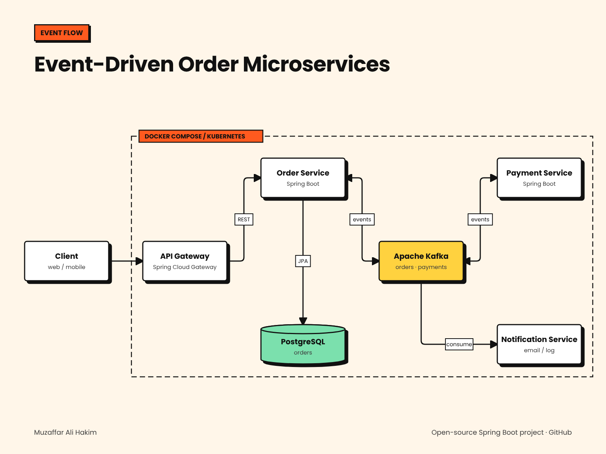

# Event-Driven Order Microservices


   

An order-processing system built as **Java 21 / Spring Boot microservices** that talk through **Apache Kafka**.
It shows a **choreographed saga**: an order starts as `PENDING`, payment-service charges it, and the order becomes `CONFIRMED` or `CANCELLED` based on the payment event. Clients enter through a **Spring Cloud Gateway**.



## Services

| Service | Port | Responsibility | Tech |
| --- | --- | --- | --- |
| `api-gateway` | 8080 | Single entry point, routes `/api/orders` and `/api/notifications` | Spring Cloud Gateway |
| `order-service` | 8081 | REST API for orders, stores them in PostgreSQL, publishes `orders`, consumes `payments` | Spring Web, Data JPA, Kafka |
| `payment-service` | 8082 | Consumes `orders`, charges (simulated limit), publishes `payments` | Spring Kafka |
| `notification-service` | 8083 | Consumes both topics and sends customer notifications | Spring Kafka, Web |
| `common-events` | – | Shared event contracts (`OrderCreatedEvent`, `PaymentEvent`, topic names) | Java records |

## How the saga works

```
Client ──POST /api/orders──▶ api-gateway ──▶ order-service
                                              │ 1. save order (PENDING) in PostgreSQL
                                              │ 2. after commit → Kafka "orders"
                                              ▼
                       payment-service ◀── "orders" ──▶ notification-service ("order received")
                              │ 3. charge, publish result
                              ▼
                         Kafka "payments" ──▶ order-service (4. CONFIRMED / CANCELLED)
                                         └──▶ notification-service ("confirmed" / "cancelled")
```

Design choices worth noting:

- **Publish after commit** — `@TransactionalEventListener(AFTER_COMMIT)` sends the Kafka event only once the order is saved, so no event exists for a rolled-back order.
- **Idempotent consumers** — the order only changes while `PENDING`, and payment-service remembers processed order ids, so redelivered messages are safe.
- **Keyed messages** — events are keyed by order id, so all events for one order land on the same partition and stay in order.
- **Optimistic locking** — `@Version` on the order entity prevents lost updates.

## Run it

```bash
docker compose up --build
```

Place an order through the gateway:

```bash
curl -s -X POST localhost:8080/api/orders -H "Content-Type: application/json" \
  -d '{"customerId":"cust-42","product":"Mechanical keyboard","quantity":2,"unitPrice":60.00}'
```

```json
{ "id": 1, "customerId": "cust-42", "total": 120.00, "status": "PENDING", ... }
```

A moment later:

```bash
curl -s localhost:8080/api/orders/1              # "status": "CONFIRMED"
curl -s "localhost:8080/api/notifications?customerId=cust-42"
```

Orders above the payment limit (default 1000.00) are **CANCELLED** with a reason — try `"quantity": 20`.

## Tests

```bash
mvn verify
```

- `order-service`: unit tests for the order state machine, plus an **end-to-end test with an embedded Kafka broker** (REST → DB → `orders` topic → `payments` topic → status change)
- `payment-service`: limit and duplicate-message handling
- `notification-service`: ordering, filtering and capacity of the notification store

## Kubernetes

Manifests in [`k8s/`](k8s) deploy every service with readiness/liveness probes, resource limits and a LoadBalancer for the gateway:

```bash
# build and push images (replace YOUR_REGISTRY in k8s/*.yaml)
for m in order-service payment-service notification-service api-gateway; do
  docker build --build-arg MODULE=$m -t YOUR_REGISTRY/$m:1.0.0 . && docker push YOUR_REGISTRY/$m:1.0.0
done
kubectl apply -f k8s/
```

The bundled Kafka and PostgreSQL are single-node and meant for demos.

## Project structure

```
order-microservices
├── common-events          # shared event records and topic names
├── order-service          # REST + JPA + Kafka producer/consumer
├── payment-service        # Kafka consumer/producer
├── notification-service   # Kafka consumer + REST
├── api-gateway            # Spring Cloud Gateway
├── k8s                    # Kubernetes manifests
├── docker-compose.yml
└── Dockerfile             # one Dockerfile, --build-arg MODULE=<service>
```

## Next steps

- Transactional outbox table instead of publish-after-commit, for guaranteed delivery
- Dead-letter topic and retry policy for poison messages
- Distributed tracing with Micrometer Tracing and Zipkin

## License

MIT
